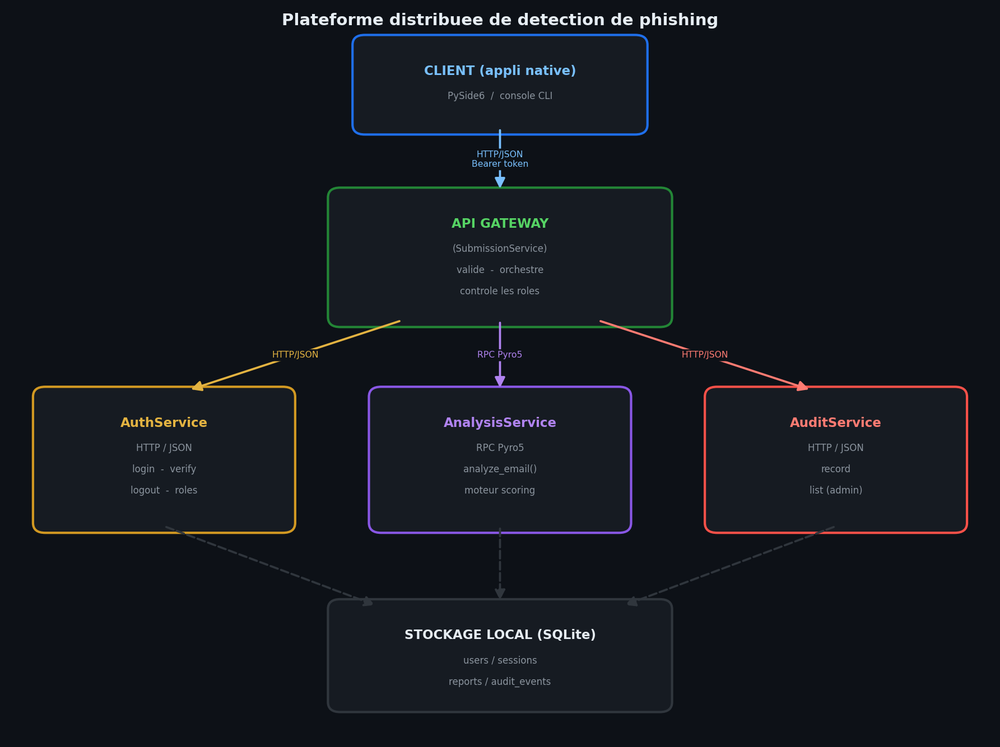

# Rapport synthetique

## Plateforme distribuee de detection et qualification d'e-mails de phishing

*Module : Applications reparties et cybersecurite — Projet de fin de semestre*

---

## 1. Contexte et objectif

Les campagnes de phishing — souvent assistees par IA — figurent parmi les
menaces les plus courantes en entreprise. Un employe recoit quotidiennement des
e-mails suspects : faux liens, demandes urgentes, usurpation d'identite, pieces
jointes douteuses.

L'objectif de ce projet est de concevoir une **mini plateforme distribuee**
permettant a une organisation de **centraliser, analyser et qualifier** ces
signalements. Il ne s'agit pas d'un antivirus complet, mais d'une application
**pedagogique, structuree et securisee** mettant en pratique les notions du
module : applications reparties, APIs, serialisation, gestion des erreurs,
RPC / objets distants et securite *by design*.

Concretement, la plateforme permet :

- l'authentification des utilisateurs (avec roles) ;
- la soumission d'un e-mail suspect ;
- son analyse par un service dedie et l'attribution d'un score de risque
  (faible / moyen / eleve) avec justification ;
- la consultation et la recherche dans l'historique des signalements ;
- la tracabilite des actions sensibles via un journal d'audit.

---

## 2. Architecture distribuee

### 2.1 Vue d'ensemble

L'application est decoupee en **quatre services independants**, chacun dans son
propre processus, plus un **client**. Ce decoupage illustre la **separation des
responsabilites** propre aux architectures reparties.

Le **client** ne communique qu'avec l'**API Gateway**. Celle-ci joue le role de
point d'entree unique et **orchestre** les autres services. Cette centralisation
simplifie le client, isole la logique d'autorisation et limite la surface
d'attaque exposee.

### 2.2 Les composants

| Composant | Responsabilite | Technologie |
|-----------|----------------|-------------|
| **API Gateway** (SubmissionService) | Recoit les requetes du client, valide les entrees, controle les roles, orchestre les appels, persiste les signalements. | `http.server` (HTTP/JSON) |
| **AuthService** | Gere les comptes, verifie les identifiants, emet et valide les tokens, expose les roles. | `http.server` (HTTP/JSON) |
| **AnalysisService** | Applique le moteur de scoring heuristique. Expose comme **objet distant**. | **Pyro5 (RPC)** |
| **AuditService** | Enregistre les evenements de securite dans un journal durable. | `http.server` (HTTP/JSON) |
| **Client** | Interface utilisateur. | PySide6 (natif) + console |

### 2.3 Communications

Trois des quatre liaisons inter-services utilisent **HTTP avec des echanges en
JSON**. La quatrieme — l'appel a AnalysisService — utilise **Pyro5**, un
mecanisme de **RPC / objet distant** : la Gateway obtient un *proxy* de l'objet
distant et invoque sa methode `analyze_email(...)` comme si l'objet etait local.
Pyro5 gere la serialisation et le transport reseau de maniere transparente.

Ce choix satisfait l'exigence d'« au moins un mecanisme RPC ou objet distant »,
et permet de **comparer concretement** deux paradigmes de communication dans une
meme application : appel HTTP/JSON classique d'un cote, invocation d'objet
distant de l'autre.

### 2.4 Choix techniques justifies

- **Python uniquement**, conformement a la consigne.
- **Aucune dependance a une API payante ou a un service cloud.** Trois services
  sur quatre n'utilisent que la librairie standard. Seuls le client (PySide6) et
  AnalysisService (Pyro5) ont des dependances externes.
- **SQLite** pour le stockage : zero serveur a installer, un simple fichier, ce
  qui rend le projet **demontrable localement sur une seule machine**.
- **Pyro5** plutot que gRPC : plus simple a mettre en oeuvre en Python pur (pas
  de compilation de fichiers `.proto`), tout en illustrant parfaitement la
  notion d'objet distant.
- **PySide6** pour le client : permet une **application native** (`.app` sur
  macOS, `.exe` sur Windows) via PyInstaller, conformement a la demande.

---

## 3. Le moteur d'analyse (scoring)

### 3.1 Principe

Le moteur reste volontairement **simple et transparent** : il n'utilise pas de
modele d'IA opaque, mais un **score cumulatif fonde sur des regles
explicables**. Chaque regle declenchee ajoute des points *et* une justification
textuelle. Le total est ensuite traduit en niveau de risque.

Cette transparence est un choix delibere : chaque decision peut etre **justifiee
a l'utilisateur**, ce qui correspond a l'esprit de l'enonce et constitue, en
matiere de securite, une qualite (auditabilite) plutot qu'une limite.

### 3.2 Regles implementees

| Regle | Indicateur detecte | Points |
|-------|--------------------|--------|
| Vocabulaire d'urgence | "urgent", "compte bloque", "sous 24h"... | +8 par terme (max 24) |
| Demande d'informations sensibles | "mot de passe", "carte bancaire", "code PIN"... | +12 par terme (max 30) |
| Presence de liens | nombre d'URLs dans le message | +5 |
| Adresse IP brute en lien | `http://192.168.x.x/...` | +20 |
| URL raccourcie | bit.ly, tinyurl... (masque la destination) | +12 |
| Extension de domaine a risque | .tk, .xyz, .click... | +10 |
| Ecart expediteur / liens | le domaine de l'expediteur ne correspond a aucun lien | +15 |
| Piece jointe annoncee | mention ou presence d'une piece jointe | +8 |
| Typosquatting de marque | "paypa1" imitant "paypal" (distance d'edition) | +18 |

### 3.3 Traduction en niveau

Le score est borne entre 0 et 100, puis :

- **eleve** si score >= 45 ;
- **moyen** si 20 <= score < 45 ;
- **faible** sinon.

### 3.4 Validation experimentale

Le jeu de donnees de demonstration (6 e-mails couvrant les trois niveaux) est
classe **6/6 correctement** par le moteur. Exemples :

- `securite@paypa1-verification.tk` (urgence + demande de mot de passe + IP
  brute + typosquatting) -> **eleve** (score 100) ;
- `newsletter@promo-incroyable.click` (urgence moderee + URL raccourcie) ->
  **moyen** (score 40) ;
- `marie.dupont@mon-entreprise.com` (e-mail interne normal) -> **faible**
  (score 8).

---

## 4. Securite *by design*

La securite a ete integree des la conception. Les principales menaces et leurs
contre-mesures sont detaillees dans `docs/menaces.md` ; en voici les axes
majeurs.

### 4.1 Mots de passe et tokens

Les mots de passe ne sont **jamais stockes ni affiches en clair**. Ils sont
haches avec **PBKDF2-HMAC-SHA256**, un sel aleatoire par utilisateur et 200 000
iterations. Les comparaisons utilisent `hmac.compare_digest` (resistance aux
attaques temporelles).

Cote sessions, c'est le **hash** du token qui est stocke, pas le token lui-meme :
une fuite de la base ne livre pas de tokens exploitables. Les tokens ne sont
**jamais journalises en entier** (seul un prefixe masque est loggable), et les
sessions **expirent** (TTL).

### 4.2 Validation des entrees

Aucune donnee venant du client n'est consideree comme fiable. Toutes les entrees
sont **validees et nettoyees cote serveur** : verification du type, du format
(ex. adresse e-mail, caracteres autorises dans un login), **limitation de
taille**, et retrait des caracteres de controle. Cette validation est faite a la
Gateway *et* re-faite dans AnalysisService (**defense en profondeur**).

### 4.3 Injection SQL

Toutes les requetes utilisent des **parametres lies** (`?`), jamais de
concatenation de chaines. Un test unitaire verifie qu'une tentative d'injection
dans le champ login est bien rejetee par la validation.

### 4.4 Serialisation / deserialisation

Le risque classique est l'**execution de code a la deserialisation** (typique de
`pickle`). Ce risque est ecarte : les echanges HTTP utilisent **JSON**, et Pyro5
est laisse sur son serializer par defaut **serpent**, qui ne deserialise que des
types de base — jamais des objets arbitraires. Aucun usage de `pickle` dans le
projet.

### 4.5 Controle d'acces et roles

Chaque route protegee verifie le token (`require_auth`). Deux roles existent :
**administrateur** et **analyste**. La consultation du **journal d'audit est
reservee a l'administrateur** (`require_role`). Un test confirme qu'un analyste
recoit une erreur 403 sur cet endpoint.

### 4.6 Robustesse face aux abus

- **Rate limiting** par IP (fenetre glissante) -> HTTP 429 en cas de flood.
- **Limitation de taille** des corps de requete -> HTTP 413.
- **Messages d'erreur generiques** cote client : le detail technique reste dans
  les logs serveur, jamais expose a l'utilisateur.
- **Anti-enumeration de comptes** : message identique que le login existe ou non.

---

## 5. Resilience et gestion des erreurs

L'enonce insiste sur la robustesse d'une application repartie. Trois mecanismes
sont en place :

1. **Timeout sur chaque appel distant** (5 s par defaut), tant pour les appels
   HTTP que pour les appels Pyro5. Un service lent ne bloque pas indefiniment la
   chaine.
2. **Gestion propre de l'indisponibilite.** Si AnalysisService est injoignable,
   la Gateway renvoie une erreur 503 claire et **trace l'echec dans l'audit**,
   plutot que de planter.
3. **Audit best-effort.** Si AuditService est indisponible, l'operation metier
   (la soumission) **n'echoue pas** ; l'indisponibilite est journalisee
   localement. Le metier est ainsi decouple de la tracabilite.

Un endpoint `/health` permet de visualiser en direct l'etat de chaque
dependance, ce qui facilite la demonstration de la resilience.

---

## 6. Journalisation (audit)

Deux niveaux de journalisation coexistent :

- **Logs techniques structures** (format JSON, une ligne par evenement) ecrits
  par chaque service dans `data/logs/`. Ils sont lisibles par un humain et
  exploitables par une machine (filtrage, recherche). Ils ne contiennent **ni
  mot de passe ni token complet**.
- **Journal d'audit metier** (table `audit_events`) centralisant les actions
  sensibles : connexions, soumissions, echecs, refus d'acces. Il est consultable
  par l'administrateur via l'interface.

---

## 7. Le client (application native)

Le client est une **application native** developpee avec **PySide6**. Il propose
une fenetre de connexion puis une interface a onglets : *Soumettre*,
*Historique*, *Recherche*, et *Audit* (visible uniquement pour l'administrateur).
Les niveaux de risque sont mis en evidence par un code couleur (vert / orange /
rouge).

Le client peut etre **compile en executable autonome** via PyInstaller
(`scripts/build_app.py`) : `.app` sur macOS, `.exe` sur Windows. Une version
**console** (`client/cli.py`) est egalement fournie pour les tests rapides et
les environnements sans interface graphique. Les deux clients partagent la meme
couche d'acces reseau (`client/api.py`) et ne dialoguent qu'avec la Gateway.

---

## 8. Tests et validation

- **Tests unitaires** du moteur d'analyse (6 tests) et de la securite (8 tests :
  hachage, masquage de tokens, validation, anti-injection). Les 14 passent.
- **Test de bout en bout** (`scripts/e2e_test.py`) : demarre les quatre
  services, deroule un scenario complet (refus d'acces non authentifie, rejet de
  mauvais identifiants, connexion, soumission phishing et legitime, liste,
  recherche, refus d'audit a l'analyste, acces admin a l'audit, health-check)
  puis arrete tout. Tous les controles passent.
- **Demonstration automatique** (`scripts/demo.py`) : classe 6/6 les e-mails du
  jeu de donnees au bon niveau.

---

## 9. Limites et pistes d'amelioration

Par honnetete intellectuelle, plusieurs limites sont assumees, le projet devant
rester *simple, propre et demontrable localement* :

- **Transport non chiffre** : tout est en local (127.0.0.1). En production, il
  faudrait HTTPS/TLS entre les composants.
- **Base non chiffree** : SQLite en clair ; on pourrait utiliser SQLCipher.
- **Moteur heuristique** : volontairement simple. Il pourrait etre enrichi
  (analyse d'en-tetes SPF/DKIM, reputation de domaines, modele statistique).
- **Tokens opaques** : un systeme de production utiliserait des jetons signes
  (JWT) avec rotation et revocation fine.

Pistes envisagees (bonus) : tableau de bord web, comparaison JSON vs Protobuf,
file d'attente asynchrone, circuit breaker, versionnement des signalements.

---

## 10. Conclusion

La plateforme repond a l'ensemble des fonctionnalites obligatoires :
authentification avec roles, soumission et analyse, scoring explicable,
consultation et recherche, audit et resilience. Elle illustre une **vraie
architecture repartie** (quatre processus communiquant en HTTP/JSON et en
RPC Pyro5), avec une **separation claire des responsabilites** et une **prise en
compte serieuse de la securite** a chaque etape.

Conformement a la consigne finale, le choix a ete fait de privilegier une
**solution simple, fonctionnelle, bien structuree et securisee** plutot qu'une
plateforme trop ambitieuse mais incomplete.
